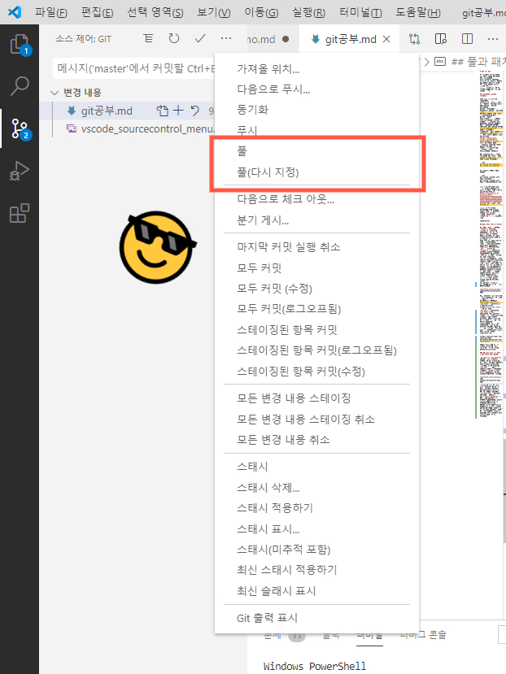

# GET IT! GIT

이 마크다운 문서는 GIT을 공부하는 과정을 기록하기 위한 문서입니다.  
git과 github를 하나하나 차근차근 공부하면서, 배우는 자료중에서 기록으로 남기고 싶은 것을 모아둔 문서로 만드려고요.ㅎㅎ  
_(음... 서문이 마음에 안 드는데 언젠가 좋은 문구가 생각나겠지?)_

## vscode에서 github 로그아웃

방금 알게 된 충격적인 사실이에요.
vscode로 내 저장소 (저장소 소유 계정이 'ForteDev'인)로 계속 커밋하고 푸시하고 있었습니다.  
푸시하고 GitHub에서 확인하면서 작업하고 있었는데...  
커밋하는 계정을 보니 '오잉?' 'ForteDevBlog'에서 커밋하고 있네?  
오호 로그인할 때 부계정을 사용했던 겁니다. 블로그 포스팅할 때 사용하는 임시 계정인데, 그것도 언젠가는 삭제할 계정인데 말이죠... (삭제하면 커밋 기여자 정보가 어떻게 바뀔려나?)  
그래서 vscode에서 로그아웃하고 다시 본계정으로 접속하려고 합니다.  
구글에서 정보를 빠르게 찾을 수 있었어요.  
[https://meaownworld.tistory.com/78] 에 잘 정리해 두셨더라고요.  
게시글을 보니까 계정 변경하는게 생각보다 어려운 작업이었나 봐요. 😥  
이렇게 글로 정리해주신 글쓴이의 희생에 감사드립니다. （￣︶￣）↗　 

읭? 생각보다 훨씬 쉬운데? *블로그에 나온 내용은 다른 내용인 것 같다.*  
그냥 vscode 터미널에서

```git
git config user.name  
git config user.email  
```

을 파악해서 연결된 계정 확인하고

```git
git config --global user.name "ForteDev"
git config --global user.email "whdtjd419@naver.com'
```

으로 적어주니 그냥 되네  
흠 왜 이렇게 간단하게 잘 되는지는 모르겠는데 일단 잘 됐으니 다행이네 😄
[https://hashcode.co.kr/questions/4342/git%EC%97%90-%EB%93%B1%EB%A1%9D%EB%90%9C-%EA%B3%84%EC%A0%95-%EB%B3%80%EA%B2%BD%ED%95%98%EB%8A%94-%EB%B0%A9%EB%B2%95] 에서 힌트를 얻을 수 있다.  

> p.s. 어 이 내용을 기록하다가 보니 windows os에서 이모지를 입력하는 방법을 알게 되었다.  
> 그냥 `윈도우 키 + '` 혹은 `윈도우 키 + ;` 만 입력하면 된다.  

<2020-04-23>  

## 풀과 패치 (Pull & Fetch)

처음에는 `HTML`만 배우려고 `vscode`를 깔았는데, `vscode`를 `github`와 연동하니까 `git`공부까지 덤으로 되는 것 같아요.  
완전 일석이조로 공부하는 셈이니 학습효율이 엄청 높은 것 같네요. 🎉  
둘을 같이 공부하긴 해도 공부 방법은 상이하답니다. `HTML`은 전문 웹사이트에서 HTML태그를 하나하나씩 체계적으로 배우는데 반해 `git`은 `GitHub`나 `vscode`를 만지작거리면서 직면하는 상황을 해결하며 무작정배우는 느낌이네요.  
`HTML`공부를 패키지 여행에 비유하면 제가 하는 `git`공부는 계획없이 떠나는 무전여행이랄까요? 무전여행도 무전여행 나름대로의 낭만과 뜻하지 않게 만나는 즐거움이 있듯이 `git` 공부도 그런 것 같아요. `git`을 조작하면서 나타나는 문제점이나 새로운 기능들이 골머리를 썩게하는 난관처럼 느껴지지 않아요. 오히려 새로운 것을 알게 된다는 기분에 들뜨는 여행같은 느낌이 드네요. ~~구글링만 하면 손쉽게 해답을 얻을 수 있으니까 망정이지~~  
그러다 오늘 `vscode`로 공부하다가 다음과 같은 창과 조우했습니다.  

  

처음 들어보는 `git fetch`에 대해서 얘기하더라고요. 창에 뜬 말을 제 짧디짧은 영어실력으로 번역하면 <u>***주기적으로 코드를 `git fetch`할까요?***</u> (~~역시나 해석이 어색하구먼~~) 라는 뜻이라고 할 수 있겠네요.  
<<<<<<< HEAD
`git pull`은 들어봤어도 `git fetch`는 처음 들어보네요. 처음들어보는 개념인 만큼 창은 아직 닫지 말고 구글 검색창에 `git fetch`라고 검색해봤습니다.  
찾아보니 `git fetch`에 대한 양질의 글이 정말 많더라고요. 그중에서 다음 링크에서 좋은 내용을 읽을 수 있었습니다.  

<https://www.git-tower.com/learn/git/faq/difference-between-git-fetch-git-pull>  
=======
`git pull`은 들어봤어도 `git fetch`는 처음 들어보네요. 처음들어보는 개념인 만큼 검색을 통해 답을 찾아봐야겠다는 생각이 들었어요. 그래서 알림창을 그대로 놔두고 구글에 관련 정보를 수집하기 시작했습니다. 여러 글을 살펴봤는데, `git`을 처음 배워보는 입장에서 가장 좋은 글은 다음 링크의 글이었어요. 영어지만 간단명료하게 핵심만 쫙쫙 짚으며 개념을 알려주더라고요.  

<https://www.git-tower.com/learn/git/faq/difference-between-git-fetch-git-pull> 

그래서 이제 제가 공부한 개념을 되짚을 겸 `git fetch`에 대한 위 링크의 설명을 요약해볼게요.

### 풀(`git pull`)과 패치(`git fetch`)의 공통점

`git pull`과 `git fetch`는 상당히 유사한 개념이라고 합니다. 둘 다 `GitHub`와 같은 원격저장소에서 데이터를 다운로드하는 명령어이기 때문이죠. 이 두 명령어중 `git pull`은 저에게 *그나마* 익숙한 개념인데요. 왜냐하면 `vscode`를 통해 코드를 작성하면서 꽤 자주 사용하는 기능이기 때문이죠. `vscode`를 사용하면 `git`기능을 담당하는 '소스제어 항목' (왼쪽 아래 사진의 빨간색으로 표시한 부분)에서 풀버튼(오른쪽 아래 사진)을 클릭하며 `GitHub`같은 원격저장소에서 소스 파일을 다운로드하게 됩니다.

<center>
     
    &nbsp&nbsp&nbsp&nbsp&nbsp
    
    <br>
    <i>vscode 소스제어 메뉴의 <b>풀 (git pull)</b> 기능</i>
</center>

`vscode`의 왼쪽 큰 `git pull` 명령어는 말 그대로 원격저장소에서 데이터를 땡겨오는(영어로 pull)는 역할을 합니다. 다시말해 `git pull`이라고 실행하면 프로그램은 자동으로 원격저장소 (`GitHub`같은)에서 최신 데이터를 제 컴퓨터로 가져옵니다. 새로운 파일이 추가되었으면 제 컴퓨터에 다운로드하고, 기존의 파일이 수정되었으면 수정본으로 파일을 덮어쓰는 작업을 수행하죠. 그래서 여러 사람이 함께 작업하는  특히 두 대의 컴퓨터를 사용해서 작업하다 보면 사용하게 되는 일이 더 잦아지는 것 같습니다.  
>>>>>>> 3fcaa3eb6de01b0f944193eabde75b371b02cd7c
