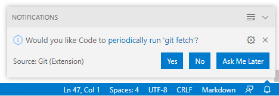

# GET IT! GIT

이 마크다운 문서는 GIT을 공부하는 과정을 기록하기 위한 문서입니다.  
git과 github를 하나하나 차근차근 공부하면서, 배우는 자료중에서 기록으로 남기고 싶은 것을 모아둔 문서로 만드려고요.ㅎㅎ  
_(음... 서문이 마음에 안 드는데 언젠가 좋은 문구가 생각나겠지?)_

## vscode에서 github 로그아웃

방금 알게 된 충격적인 사실이에요.
vscode로 내 저장소 (저장소 소유 계정이 'ForteDev'인)로 계속 커밋하고 푸시하고 있었습니다.  
푸시하고 GitHub에서 확인하면서 작업하고 있었는데...   
커밋하는 계정을 보니 '오잉?' 'ForteDevBlog'에서 커밋하고 있네?  
오호 로그인할 때 부계정을 사용했던 겁니다. 블로그 포스팅할 때 사용하는 임시 계정인데, 그것도 언젠가는 삭제할 계정인데 말이죠... (삭제하면 커밋 기여자 정보가 어떻게 바뀔려나?)   
그래서 vscode에서 로그아웃하고 다시 본계정으로 접속하려고 합니다.   
구글에서 정보를 빠르게 찾을 수 있었어요.  
[https://meaownworld.tistory.com/78] 에 잘 정리해 두셨더라고요.   
게시글을 보니까 계정 변경하는게 생각보다 어려운 작업이었나 봐요. 😥  
이렇게 글로 정리해주신 글쓴이의 희생에 감사드립니다. （￣︶￣）↗　 

읭? 생각보다 훨씬 쉬운데? *블로그에 나온 내용은 다른 내용인 것 같다.*   
그냥 vscode 터미널에서

```git
git config user.name    
git config user.email   
```

을 파악해서 연결된 계정 확인하고

```git
git config --global user.name "ForteDev"
git config --global user.email "whdtjd419@naver.com'
```

으로 적어주니 그냥 되네  
흠 왜 이렇게 간단하게 잘 되는지는 모르겠는데 일단 잘 됐으니 다행이네 😄
[https://hashcode.co.kr/questions/4342/git%EC%97%90-%EB%93%B1%EB%A1%9D%EB%90%9C-%EA%B3%84%EC%A0%95-%EB%B3%80%EA%B2%BD%ED%95%98%EB%8A%94-%EB%B0%A9%EB%B2%95] 에서 힌트를 얻을 수 있다.   

> p.s. 어 이 내용을 기록하다가 보니 windows os에서 이모지를 입력하는 방법을 알게 되었다.  
> 그냥 `윈도우 키 + '` 혹은 `윈도우 키 + ;` 만 입력하면 된다.  

<2020-04-23>  

## 풀과 패치 (Pull & Fetch)

'그래 프로그래밍 공부해야지... 근데 언제 하지😴' 라고 생각하며 1년이라는 긴 시간을 홀라당 까먹고 있던 저에게 `vscode`를 설치하고 `github`와 연동하며 공부하니까 정말 재미있는 것 같아요. 이 쉬운 공부를 왜 이제서야 시작했을까! 😂  
요즘은 `vscode`로 코드 작성하고 커밋하고 `github` 저장소로 푸시하는 작업을 무한 반복하고 있어요. 근데 그러다가  

  
**git fetch** 이건 뭐지? 뭔가 알지도 못하면서 순진하게 Yes를 클릭하면 안되겠다는 직감이 들었다.  
기능부터 알아봐야 겠다는 생각이 들었고, 구글링을 통해  
<https://www.git-tower.com/learn/git/faq/difference-between-git-fetch-git-pull>